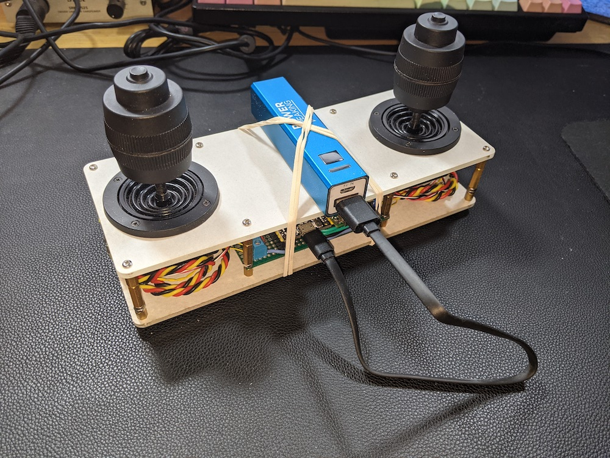

# 3d-joystick-controller
Firmware for an experimental OSC controller using 2 3D joysticks and ESP32.

## Description

The inpsiration for this controller came from seeing a demo of the [Doepfer A-174-4](https://doepfer.de/a1744.htm) 3D Joystick Eurorack module. These types of 3D joysticks are commonly used in controllers for Pan, Tilt, Zoom cameras, but those controllers are usually very expensive. I managed to find the part used in the Doepfer module, [JH-D400X-R4](https://www.aliexpress.com/i/32333754018.html), and decided to build a controller around two of them. I wanted to use this controller with audiovisual and multimedia software applications, so the controller outputs OSC messages.

The joysticks and protoboard are mounted in a laser cut acryllic case.

### Hardware

The analog voltage from the 3 potentiometers on each joystick is read by the MCP3208 12-bit ADC. The ADC is powered and referenced from the 3.3V rail from the onboard power supply of the ESP32 Devkit-C, which isn't ideal but good enough for this prototype. The onboard ADC of the ESP32 has some accuracy issues, especially when Wi-Fi is being used.

A WizNet W5500 Ethernet controller is used for Ethernet output. The ESP32 has an onboard Ethernet MAC, but prototype development time was much faster with the W5500 since development boards were more readily available than Ethernet PHY development boards.

### Firmware

After initializing the ADC and configuring Ethernet/ WiFi peripherals in setup(), the main loop() reads the 6 joystick potentiometer voltages and checks the state of the button on each joystick. The joystick values are scaled down to floats between 0.0 and 1.0 and all are then sent out as individual OSC messages.

## Installation

platformIO Installation:
1. Download and Install [VSCode](https://code.visualstudio.com/)
2. Add the [PlatformIO](https://platformio.org/) extension
2. The dependencies are included in the platformio.ini file, so platformIO will download them when you build.

### Dependencies
- ArduinoOSC
- Ethernet

## Usage
As this is still just a prototype, this repository is mainly to serve as an example for using ESP32 microcontrollers to create OSC controllers.

### OSC

[Open Sound Control](https://opensoundcontrol.stanford.edu/) is a protocol for sending real time communication messages between synthesizers, computers, and other multimedia devices.

By default, the device will send the OSC messages to port 8000 at IP address 192.168.1.202 regardless of whether WiFi or Ethernet is used. If you want to change this, the relevant global variables are host and send_port_osculator

OSC addresses used:
- /left/x
- /left/y
- /left/z
- /left/button
- /right/x
- /right/y
- /right/z
- /right/button

All of the values are sent as floats within the range 0.0 to 1.0. Due to manufacturing tolerances in the potentiometers of the joysticks, the neutral position isn't *exactly* (0.5, 0.5, 0.5) but it was close enough for what I needed it for. 

I use this with the OSC routing application [OSCulator](https://osculator.net/), which is highly recommended if you're using MacOS. [OSCRouter](https://github.com/ETCLabs/OSCRouter) from ETCLabs is another option.